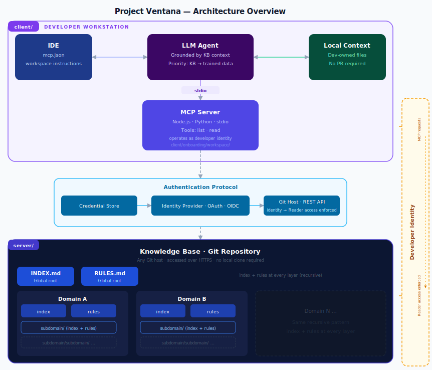

# Project Ventana

A proven agentic workflow framework that connects LLM agents to a shared enterprise knowledge base via a lightweight, stdio-based Model Context Protocol server — requiring no additional infrastructure beyond a Git repository and a Node.js runtime already present on each developer's machine.

Presented by **[Matt Borja](https://linkedin.com/in/mattborja)** at **ACCTC 2026**, hosted by **Pima Community College**, week of June 22nd, 2026.

> **Enabling an AI-Powered Workforce to Achieve Maximum Productivity**
> 
> Demonstration of a proven, viable workflow that exploits the agentic capabilities of AI to accelerate teams in their research, development, and release of technical solutions at scale.


---

## Architecture



---

## Repository Structure

This repository is a deployment template. It contains two self-contained components with distinct deployment targets:

| Directory | Deploy to | Purpose |
|-----------|-----------|---------|
| `server/` | Azure Repos (shared, hosted) | The knowledge base — curated content the LLM reads on every connection |
| `client/` | Each developer's local machine | Onboarding scripts and workspace templates that wire up the MCP connection |

Neither component depends on the other at the file-system level. `server/` is deployed once by a maintainer; `client/` is run once per developer machine.

---

## Part 1 — Deploying the Server (Knowledge Base)

### What Gets Deployed

The `server/` directory becomes the root of a dedicated Azure Repos Git repository. When deployed, its contents are:

```
/INDEX.md                          ← Agent reads this first on every session
/RULES.md                          ← Global rules the agent must follow
/knowledge-base/
  mcp/
    INDEX.md                       ← Domain index
    RULES.md                       ← Domain rules
    stdio-implementation/
      INDEX.md                     ← Subdomain index
      RULES.md                     ← Subdomain rules
```

The LLM agent accesses this repository over HTTPS via the MCP tools `list` and `read`. It never clones the repository — every connection retrieves the latest committed state directly from the remote.

### Prerequisites

- An Azure DevOps organization and project
- Permission to create a new Git repository within that project
- Intended consumers (developers) need at minimum **Reader** access to the repository
- Recommended: branch policy on `main` requiring pull requests with at least one approver, to enforce content review before changes go live

### Steps

1. In Azure DevOps, create a new Git repository (e.g., `knowledge-base`) inside your project.
2. Copy the **contents** of `server/` — not the `server/` folder itself — into the root of that new repository.
3. Commit and push to the `main` branch.
4. Configure repository permissions:
   - Knowledge base maintainers: **Contributor**
   - Consuming developers: **Reader** (read-only; prevents unauthorized edits)
5. Configure branch policies on `main`:
   - Require a pull request for all changes
   - Add designated approvers or a reviewer group for content governance
6. Record the repository URL as `GIT_REMOTE_URL` (for example, `https://git.example.com/your-namespace/your-repository`). Developers will need this during client setup.

### Extending the Knowledge Base

To add a new domain of knowledge:

1. Create a directory at `/knowledge-base/{domain-name}/`
2. Add `INDEX.md` (describe what the domain contains) and `RULES.md` (rules specific to this domain) at the domain root
3. Add content files and subdomains as needed, each with their own `INDEX.md` and `RULES.md`
4. Update `/INDEX.md` to add the new domain to the domain table

This recursive index-and-rules pattern is the core organizing principle. It lets LLM agents navigate large knowledge bases efficiently without walking the full directory tree.

---

## Part 2 — Deploying the Client (Developer Workstation)

### What Gets Deployed

The `client/onboarding/workspace/` directory contains the files that a developer installs into their local project workspace:

| File | Install location | Purpose |
|------|-----------------|---------|
| `.vscode/mcp/server.js` | `.vscode/mcp/` | Node.js stdio MCP server; proxies KB requests over HTTPS |
| `.vscode/mcp/server.py` | `.vscode/mcp/` | Python stdio MCP server; equivalent alternative to server.js |
| `.vscode/mcp/package.json` | `.vscode/mcp/` | Declares the `@modelcontextprotocol/sdk` dependency |
| `.vscode/mcp/requirements.txt` | `.vscode/mcp/` | Declares the `mcp` Python dependency |
| `.vscode/mcp.json` | `.vscode/` | Registers the MCP server with VS Code |
| `CLAUDE.md` | Workspace root | Instructs Claude Code to consult the KB first |
| `.github/copilot-instructions.md` | `.github/` | Instructs GitHub Copilot to consult the KB first |

The MCP server authenticates against Azure Repos using credentials cached by Git Credential Manager (GCM). No tokens are stored in files; GCM transparently renews credentials against Microsoft Entra on each connection.

### Prerequisites

Each developer's machine needs:

- **Node.js 18 or later** — [nodejs.org](https://nodejs.org)
- **Git** with **Git Credential Manager** — included with Git for Windows; install separately on macOS/Linux via `brew install git-credential-manager` or the [GCM releases page](https://github.com/git-ecosystem/git-credential-manager/releases)
- **VS Code** — or another IDE with MCP server support

### Steps

**Step 1 — Configure Git host coordinates**

Open `client/onboarding/workspace/.vscode/mcp.json` and replace the placeholder values in the `env` block with the repository details from Part 1:

```json
"env": {
  "GIT_HOST_URL": "https://GIT_HOST_URL",
  "GIT_PROJECT": "GIT_PROJECT",
  "GIT_REPO": "GIT_REPO"
}
```

The onboarding script can also patch this file interactively if preferred.

**Step 2 — Run the onboarding script**

From the root of this repository:

- **macOS / Linux:**
  ```bash
  bash client/onboarding/setup.sh
  ```
- **Windows (PowerShell):**
  ```powershell
  powershell -ExecutionPolicy Bypass -File client\onboarding\setup.ps1
  ```

The script will:
- Verify Node.js, npm, and Git prerequisites
- Run `npm install` inside `client/onboarding/workspace/.vscode/mcp/`
- Prompt for your Git host coordinates and write them into `.vscode/mcp.json`
- Trigger an initial GCM authentication against your Git host (a browser window or OS credential prompt may appear)

**Step 3 — Copy workspace files into the developer's project**

Copy the contents of `client/onboarding/workspace/` into the root of the developer's project workspace (the folder they open in VS Code). For each developer and each project they work on, the following files need to be present:

```
.vscode/mcp.json
.vscode/mcp/server.js              ← Node.js MCP server
.vscode/mcp/server.py              ← Python MCP server (alternative)
.vscode/mcp/package.json
.vscode/mcp/requirements.txt
CLAUDE.md                          ← if using Claude Code
.github/copilot-instructions.md    ← if using GitHub Copilot
```

**Step 4 — Open VS Code**

Open the workspace folder in VS Code. The `ventana-kb` MCP server will appear in the MCP panel and start automatically when a Copilot or Claude chat is opened.

### Verification

In a Copilot or Claude chat window, ask:

> "What domains are available in the knowledge base?"

The agent should call `list("/")` and `read("/INDEX.md")` via the `ventana-kb` MCP tool and return a summary of the knowledge base contents.

If the agent responds without invoking the MCP tool, check that:
- `.vscode/mcp.json` is present in the workspace root
- The `ventana-kb` server shows as active (not errored) in the MCP panel
- The `GIT_HOST_URL`, `GIT_PROJECT`, and `GIT_REPO` values in `mcp.json` match the repository deployed in Part 1
- GCM has a cached credential for the configured Git host (`git credential fill` should return a password without prompting)

---

## Part 3 — Local Workspace Augmentation

Developers are not blocked by the current state of the shared knowledge base. Any context that is missing or specific to an individual's work can be added as local files in the workspace.

To use local augmentation:

1. Create a folder (e.g., `local-context/`) in the workspace and add any relevant files
2. Reference it in `CLAUDE.md` or `.github/copilot-instructions.md`:
   ```
   Additionally, consult the files in /local-context/ as a supplementary
   authoritative source, to be applied after the knowledge base and before
   trained knowledge.
   ```

If the local context becomes a persistent, recurring need, add a standing reference to it in the workspace instructions file. This makes the augmentation automatic without requiring a knowledge base pull request.

---

## Benefits

- **Speed** — Corpus searches that previously took hours complete in seconds via an agent operating at computer speed against a structured, indexed knowledge base.
- **Accuracy** — Models grounded in domain-specific, authoritative content produce output calibrated to the actual environment rather than trained approximations.
- **Automation depth** — Teams using this pattern direct their agents to write and run tests, connect to databases and web applications, perform end-to-end and parity tests, and check for regressions — all within a single session.
- **Infrastructure reach** — Permissions, sequenced deployment prerequisites, and artifact preparation can also be automated within this same agentic pipeline.
- **Low overhead** — No centralized MCP gateway to operate. The stdio server runs locally on each developer's machine; access control is enforced entirely at the Azure Repos layer.

---

## License

MIT License — Copyright (c) Matt Borja
